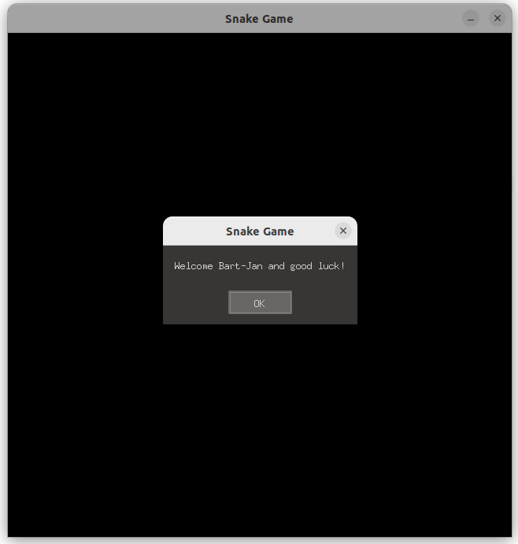
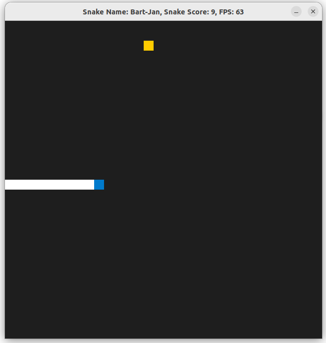
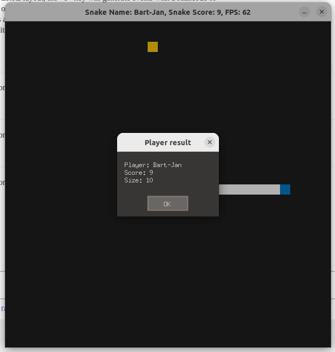
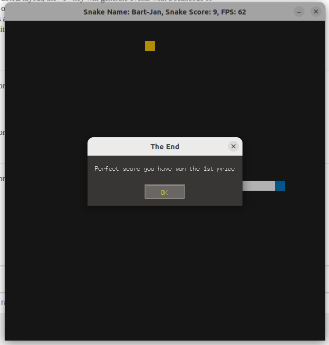

# CPPND: Capstone Snake Game 2.0

This is the repo for the Capstone project in the [Udacity C++ Nanodegree Program](https://www.udacity.com/course/c-plus-plus-nanodegree--nd213). 

The code for this repo was inspired by [this](https://codereview.stackexchange.com/questions/212296/snake-game-in-c-with-sdl) excellent StackOverflow post and set of responses. 

I have extended this code with some additional features and added the player to the game to give it a more personalized feel and keep track of the overall top 3 results. 

## Added features in the game play:
1. Welcome message

2. Game running

3. Player result message

4. Overal result message to see if player made the top 3

## Added features in the code:
CP1. Ask players nickname
Created Player class to set and get the players name which is used by other functions to personalize the game.

CP2. Welcome message
Created a WelcomeMessage() function.

CP3. Read results
Created a ReadResults() function to read the previous top 3 results from the results.txt file.

CP4. Show best results
Created a ShowResults() function to show the previous best result.

CP5. Run Game
Added the player to the Run() function to show the players name in the window title

CP6. Show player results
Created the PlayerResults() function to obtain the player results in a struct
Overloaded the ShowResults() function to show the player results.

CP7. Congratulate if in top 3
Created the UpdateResults() function to check if player made the top 3 and to create the vector struct which is used by the WriteResults() function.

CP8. Write results
Created the WriteResults() function to write the top 3 results to the results.txt file.

## Modified files:
* game.cpp
* game.h
* main.cpp
* renderer.cpp
* renderer.h

## Added files:
* Player.cpp
* Player.h

## Dependencies for Running Locally
* cmake >= 3.7
  * All OSes: [click here for installation instructions](https://cmake.org/install/)
* make >= 4.1 (Linux, Mac), 3.81 (Windows)
  * Linux: make is installed by default on most Linux distros
  * Mac: [install Xcode command line tools to get make](https://developer.apple.com/xcode/features/)
  * Windows: [Click here for installation instructions](http://gnuwin32.sourceforge.net/packages/make.htm)
* SDL2 >= 2.0
  * All installation instructions can be found [here](https://wiki.libsdl.org/Installation)
  >Note that for Linux, an `apt` or `apt-get` installation is preferred to building from source. 
* gcc/g++ >= 5.4
  * Linux: gcc / g++ is installed by default on most Linux distros
  * Mac: same deal as make - [install Xcode command line tools](https://developer.apple.com/xcode/features/)
  * Windows: recommend using [MinGW](http://www.mingw.org/)

## Basic Build Instructions
1. Clone this repo.
2. Make a build directory in the top level directory: `mkdir build && cd build`
3. Compile: `cmake .. && make`
4. Run it: `./SnakeGame2`.

## CC Attribution-ShareAlike 4.0 International

Shield: [![CC BY-SA 4.0][cc-by-sa-shield]][cc-by-sa]

This work is licensed under a
[Creative Commons Attribution-ShareAlike 4.0 International License][cc-by-sa].

[![CC BY-SA 4.0][cc-by-sa-image]][cc-by-sa]

[cc-by-sa]: http://creativecommons.org/licenses/by-sa/4.0/
[cc-by-sa-image]: https://licensebuttons.net/l/by-sa/4.0/88x31.png
[cc-by-sa-shield]: https://img.shields.io/badge/License-CC%20BY--SA%204.0-lightgrey.svg
